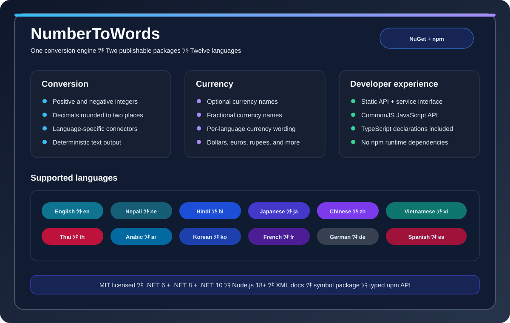

# NumberToWords

A single repository for two publishable packages:

- `NumberToWords.Core` — the .NET NuGet package, targeting `net6.0`, `net8.0`, and `net10.0`.
- `number-to-word` — the dependency-free npm package.

Both packages support converting numbers to words in English, Nepali, Hindi, Japanese, Chinese, Vietnamese, Thai, Arabic, Korean, French, German, and Spanish. Decimal values are rounded to two places and can optionally include currency names.



## Package documentation

- [NuGet / .NET package README](src/NumberToWords/README.md)
- [npm package README](packages/number-to-words/README.md)
- [Capability diagram](docs/capabilities.svg)

## Repository layout

```text
src/NumberToWords/                C# library project
tests/NumberToWords.Tests/          xUnit tests for the C# library
packages/number-to-words/       npm package source, types, and Node tests
Directory.Build.props          Shared NuGet metadata
Directory.Packages.props       Central .NET test dependency versions
```

## Prerequisites

- .NET SDK 10 or later. The library targets `net6.0`, `net8.0`, and `net10.0`.
- Node.js 18 or later and npm 9 or later.

## Development commands

Run commands from the repository root:

```bash
npm test
npm run build:nuget
npm run build:npm
npm run pack
```

`npm run pack` creates:

- NuGet packages in `artifacts/nuget/`
- The npm tarball in the repository root

The GitHub release tag is the release version source of truth. Create and push a tag such as `v1.2.3` to run both publishing workflows; the workflow passes that version to NuGet and npm publishing.

## NuGet usage

```bash
dotnet add package NumberToWords.Core
```

The C# project, assembly, and namespace are all named `NumberToWords`. The NuGet package ID is `NumberToWords.Core` because the shorter `NumberToWords` ID is already registered.

```csharp
using NumberToWords.Enum;
using NumberToWordsFacade = NumberToWords.NumberToWords;

string result = NumberToWordsFacade.Convert(12345, LanguageEnum.English);
```

The NuGet package contains XML documentation, a symbol package, the README, and the MIT license.

## npm usage

```bash
npm install number-to-word
```

```js
const { convert } = require('number-to-word');

convert(12345, 'en');                 // twelve thousand three hundred forty-five
convert(12345, 'fr');                 // douze mille trois cent quarante-cinq
convert(12.34, { language: 'en', includeCurrency: true });
```

## All languages at a glance

The same comparison is available in both package READMEs. It uses `12345` for the integer output and `12.34` with currency enabled for the second output.

| Language | `12345` | `12.34` with currency |
| --- | --- | --- |
| English | twelve thousand three hundred forty-five | twelve dollars thirty-four cents |
| Nepali | बाह्र हजार तीन सय पैंचालीस | बाह्र रुपैया चौंतीस पैसा |
| Hindi | बारह हजार तीन सौ पैंतालीस | बारह रुपया चौंतीस पैसे |
| Japanese | 万二千三百四十五 | 一十二円 三十四 銭 |
| Chinese | 一 万 二 千 三 百 四十五 | 十二元 三十四 分 |
| Vietnamese | mươi hai nghìn ba trăm bốn mươi năm | mươi hai đồng ba mươi bốn hào |
| Thai | หนึ่ง หมื่น สอง พัน สาม ร้อย สี่สิบห้า | สิบสอง บาท สามสิบสี่ สตางค์ |
| Arabic | اثنا عشر ألف ثلاثة مائة خمسة وأربعون | اثنا عشر ريال أربعة وثلاثون هللة |
| Korean | 일만이천삼백사십오 | 십이원 삼십사 전 |
| French | douze mille trois cent quarante-cinq | douze euro trente-quatre centime |
| German | zwölftausend dreihundert fünfundvierzig | zwölf Euro vierunddreißig Cent |
| Spanish | doce mil tres cien cuarenta-cinco | doce euros treinta y cuatro céntimos |

## Publishing

Publishing is automated from the GitHub release tag. Push a semantic tag such as `v1.2.3`; both workflows use that same tag version:

- `.github/workflows/publish-nuget.yml` publishes `NumberToWords.Core` to NuGet.
- `.github/workflows/publish-npm.yml` publishes `number-to-word` to npm.

Configure these GitHub repository secrets:

```text
NUGET_API_KEY
NPM_TOKEN
```

The NuGet workflow uses `--skip-duplicate`. For npm publishing, `NPM_TOKEN` must be a granular access token with package read/write access and **Bypass two-factor authentication** enabled. Never commit API keys or npm tokens. npm Trusted Publishing through GitHub Actions OIDC can be configured later as a token-free alternative after the package has been created.

To run the release workflows, create and push the tag:

```bash
git tag v1.2.3
git push origin v1.2.3
```

The workflow versions must be unique and must not reuse an already-published version.

## License

MIT. See `LICENSE`.

